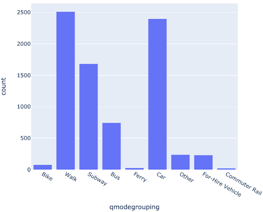
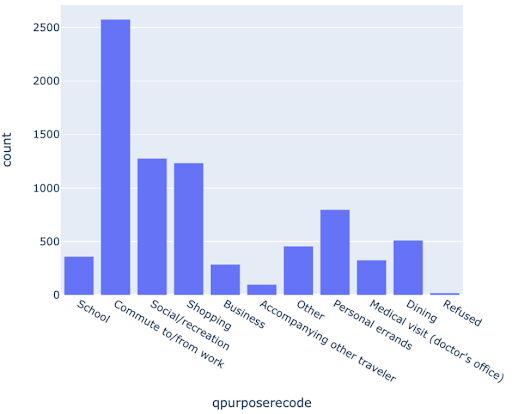
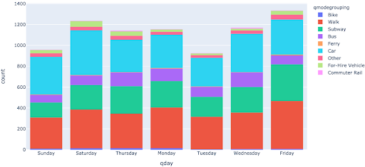
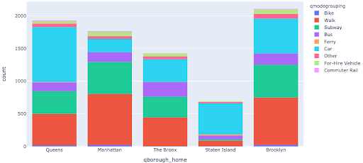
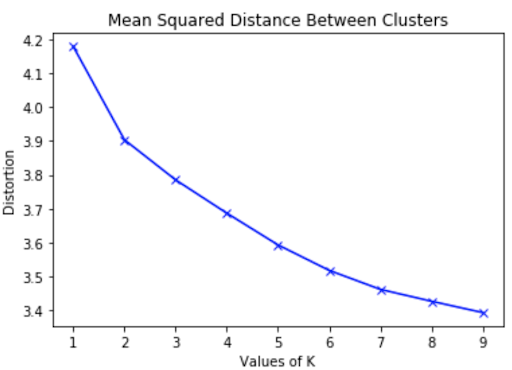
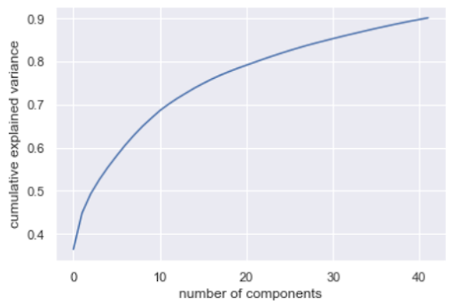
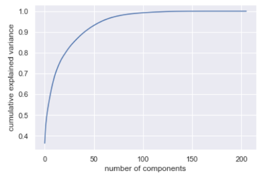
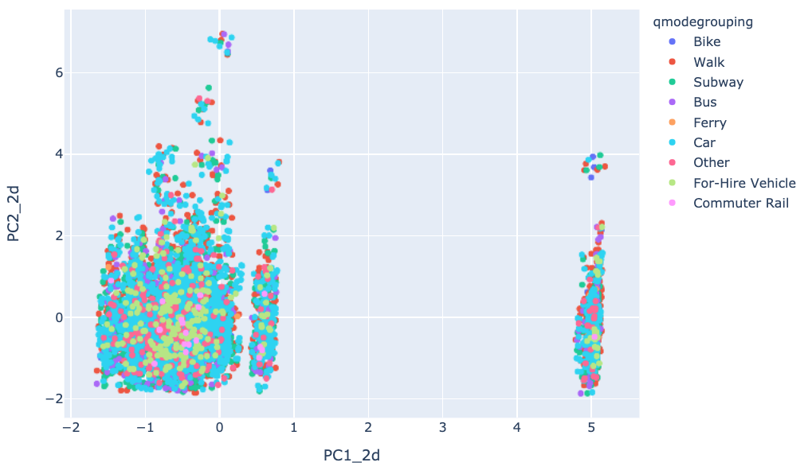
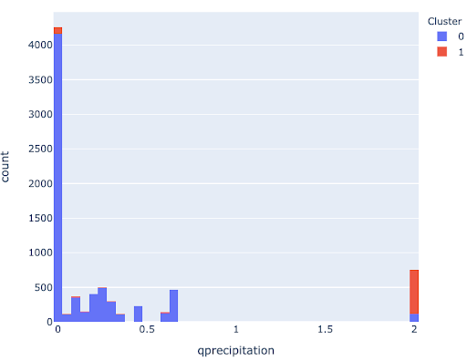
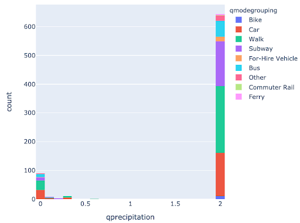

NYC Transit Clustering plus Recommendation Engine
-
To view the code used for this project, please see [NYC_Mobility.py](https://github.com/befowle/NYC_Transit_Clusters_and_Recommendations/blob/master/NYC_Mobility.py)

- Data Source: 2018 Citywide Mobility Survey of New York City residents' travel choices and behaviors (NYC Open Data)

Goal
-
- Create clusters of types of trips taken throughout New York City
- Compare trips within clusters to find a viable mass transit alternative for trips completed by car
- Motivation: If another person has completed a trip similar to your car trip using mass transit instead, you might consider doing the same!

Data Processing
-
- Remove unrelated features and features with sparse data available
- Impute missing values using mode for categorical data, median for numerical data
- Normalize numerical features
- One-hot-encode categorical features

EDA
-
- Most trips were taken by walking or by car
 

- The purpose of most trips is commuting, followed by social/recreation, then shopping
 

- There was no extreme variation in transit mode between days of the week 
 

- Breakdown of transportation mode frequency by borough
 

Cluster
-
- Clustering was performed on the dataset with the mode of transit feature removed, so that the mode of transit was not a factor to create clusters

- Determined appropriate number of clusters using the Elbow Method

Elbow Plot
 

- Performed Hierarchical Agglomerative Clustering using Ward linkages to maximize variance

- Ultimately used K-Means Clustering for its interpretability (Silhouette Score: 0.31, Calinski-Harabasz Score: 1491.88)

- Ran a Principle Component Analysis to determine how features affect variance (dataset contains 200+ features)

- 53% of variance can be explained by 4 principal components

Explained Variance (4 Components)

- 90% of variance can be explained by 42 principal components

Explained Variance (42 Components)

- Visualize clusters with mode of transit identified
 

Explore Cluster 1
-

- I explored clusters further, visualizing individual features to identify notable patterns and found that 85% of trips in Cluster 1 (the narrow cluster on the right of the scatter plot above) occurred on days with 2 inches of precipitation.

    - Logically this makes sense: precipitation impacts your mobility, the mode of transit you choose, and how long trips take.

Precipitation in Clusters
 

- Below is Cluster 1 visualized to see which types of transit were used in this cluster. No single form of transit dominates, so many forms of alternative transportation can be recommended!

- Cluster 1 mode breakdown
 

Recommendation Engines
-

- 
